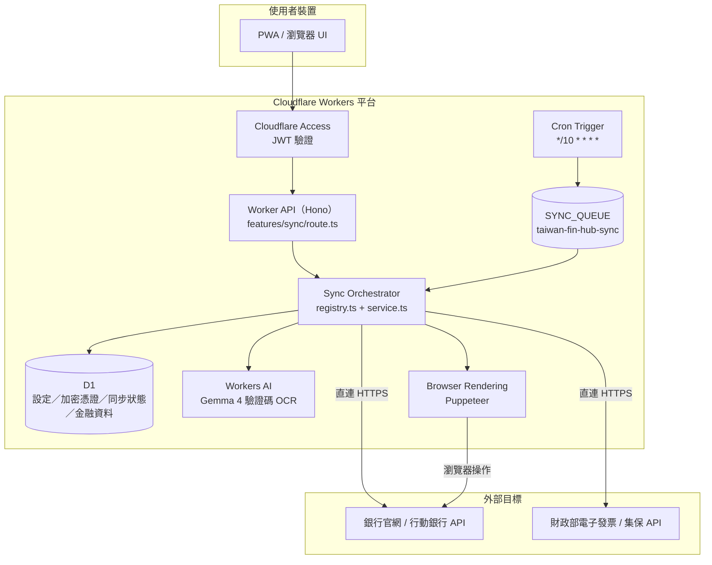
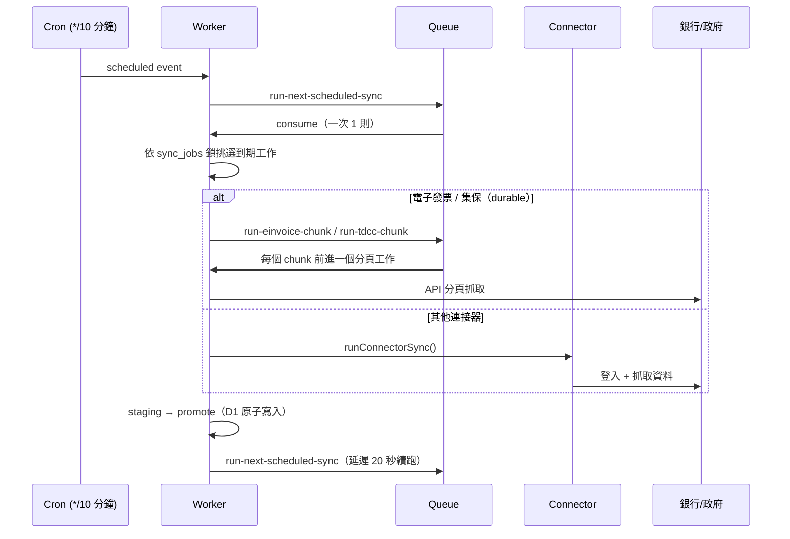

# Connector 連線方式總覽

本文件整理 Taiwan Fin Hub 每個 connector 的連線方式、驗證流程、保存狀態與同步觸發機制。實作細節與新增 connector 的規範以 [`docs/004-connector-development.md`](./004-connector-development.md) 與程式碼為準；本文件是連線行為的快速索引，連線方式變更時必須同步更新。

## 整體架構

| 元件               | 綁定               | 用途                                                     |
| ------------------ | ------------------ | -------------------------------------------------------- |
| Worker API（Hono） | —                  | 手動同步、challenge、設定與查詢 API                      |
| Cron Trigger       | `[triggers] crons` | 每 10 分鐘啟動排程同步                                   |
| Cloudflare Queue   | `SYNC_QUEUE`       | 逐一執行排程工作與 durable chunk（`max_batch_size = 1`） |
| D1                 | `DB`               | connector 設定、加密憑證、同步狀態、金融資料與 staging   |
| Workers AI         | `AI`               | `@cf/google/gemma-4-26b-a4b-it` 辨識圖形驗證碼           |
| Browser Rendering  | `BROWSER`          | 需要瀏覽器的 connector 以 Puppeteer 操作銀行網站         |
| Static Assets      | `ASSETS`           | 前端 `apps/web/dist`                                     |

連接器實作分成兩層：

- `packages/connectors`：不依賴 Hono、D1 或 Worker `Env` 的資料來源邏輯（API 協定、正規化）。
- `apps/worker/src/connectors`：需要 `BROWSER` 綁定或 Worker 專屬 session 管理的 adapter。

## 同步觸發與流程

- **手動同步**：`POST /api/connectors/:connectorId/sync`（集保另有 `/sync/investments`、`/sync/bank`、`/sync/trades`；電子發票與集保回傳 `202`，由 Queue 非同步執行）。
- **互動式 challenge**：需要圖形驗證碼的 connector 提供 `POST /api/connectors/:connectorId/captcha`，先建立 challenge、回傳驗證碼圖片與到期時間；使用者輸入後再以 `captcha`（或兆豐的 `otp`）參數呼叫同步。
- **排程同步**不會主動寄送 OTP（集保 `requestOtp = false`；兆豐僅在 `trigger === "manual"` 時允許 `allowOtpRequest`）。自動辨識失敗時標記 `needs_user_action`，排程會停止挑選該工作直到手動同步成功。
- 電子發票與集保使用 **durable run**：run、加密 session 與分頁工作存在 D1，Queue chunk 失敗會重試（最多 3 次），可跨 invocation 接續。

## 連線模式

`packages/core/src/index.ts` 的 `connectorCatalog.connectionMode` 定義六種模式：

| Mode                      | 定義                                                     | Connector                              |
| ------------------------- | -------------------------------------------------------- | -------------------------------------- |
| `api_credentials`         | 帳密登入外部 API，可自行更新 token                       | 電子發票、中信、新光                   |
| `api_device_otp`          | API 登入；裝置首次使用需 Email／SMS OTP                  | 集保                                   |
| `api_captcha_session`     | App API 登入含 CAPTCHA，challenge 加密保存               | 王道、將來、兆豐                       |
| `browser_session`         | Browser 只負責登入，後續以可復用的 HTTP session 抓資料   | 玉山                                   |
| `browser_per_sync`        | 每次同步都以 Browser 登入與擷取                          | 國泰世華                               |
| `browser_captcha_session` | Browser 登入含 CAPTCHA，可 AI 或人工完成，session 可復用 | 永豐、台新、華南、第一銀行、凱基、樂天 |

## 各 Connector 連線方式

| Connector | 模式                      | 登入與驗證                                           | 主要端點                                             | 保存狀態（`secretStateFields`）                                                                                     |
| --------- | ------------------------- | ---------------------------------------------------- | ---------------------------------------------------- | ------------------------------------------------------------------------------------------------------------------- |
| 電子發票  | `api_credentials`         | 手機條碼＋密碼；登入資料加密（`ldata`）＋JWT 簽章    | `uia.einvoice.nat.gov.tw`、`upi.einvoice.nat.gov.tw` | `userToken`、`sid`、`token`、`iv`、`svrCode`、`loginAppId`、`ltoken`、`hkey`…                                       |
| 集保      | `api_device_otp`          | 身分證＋密碼；裝置綁定＋Email／SMS OTP               | `epassbooksys.tdcc.com.tw/MPSBKV2/rest/`             | `deviceId`、`devType`、`devModel`、`session`                                                                        |
| 中信      | `api_credentials`         | 帳密 → OAuth token；handshake＋PIN 加密              | `eb.ctbcbank.com/IMP`                                | 無                                                                                                                  |
| 新光      | `api_credentials`         | 身分證＋代號＋密碼；HMAC-SHA256 簽章                 | `mbanking.skbank.com.tw`                             | `deviceId`                                                                                                          |
| 玉山      | `browser_session`         | 首次 Browser 登入取得 cookies，之後走 HTTP API       | `ebank.esunbank.com.tw`、`iesc.esunbank.com`         | `sessionCookies`、`sessionExpiresAt`                                                                                |
| 國泰世華  | `browser_per_sync`        | 每次 Browser 登入＋Email／SMS OTP                    | `www.cathaybk.com.tw/MyBank/`、`OnlineBanking/**`    | `sessionCookies`、`browserSessionId`、`browserSessionExpiresAt`、`otpChannel`                                       |
| 永豐      | `browser_captcha_session` | Browser＋6 位數字 CAPTCHA 登入後改用 mobile JSON API | `m.sinopac.com`、`/ws/card/**`、`/m/SinoCard/api/**` | `sessionCookies`、`browserSessionId`、`captcha`                                                                     |
| 台新      | `browser_captcha_session` | Browser＋數字 CAPTCHA；cookies 有效時可重用          | `my.taishinbank.com.tw/TIBNetBank/svc/rwd/`          | `sessionCookies`、`sessionCreatedAt`、`browserSessionId`、`captcha`                                                 |
| 華南      | `browser_captcha_session` | Browser＋數字 CAPTCHA；cookies 有效時可重用          | `netbank.hncb.com.tw`                                | `sessionCookies`、`sessionCreatedAt`、`browserSessionId`、`captcha`                                                 |
| 第一銀行  | `browser_captcha_session` | Browser＋英數 CAPTCHA；cookies 有效時可重用          | `ibank.firstbank.com.tw/NetBank/**`                  | `sessionCookies`、`sessionCreatedAt`、`browserSessionId`、`browserSessionExpiresAt`、`captchaDigitCount`、`captcha` |
| 凱基      | `browser_captcha_session` | Browser＋數字 CAPTCHA                                | `ib.kgibank.com.tw/ibank/`                           | `browserSessionId`、`captcha`                                                                                       |
| 樂天      | `browser_captcha_session` | 每次同步重新登入＋英數 CAPTCHA（不重用 session）     | `www.rakuten-bank.com.tw/ebank/`                     | `browserSessionId`、`browserSessionExpiresAt`、`captcha`                                                            |
| 王道      | `api_captcha_session`     | App API＋英數（4 碼）CAPTCHA；OAuth token            | `www.o-bank.com/ebank/ixtein`                        | `pendingSession`、`pendingSessionExpiresAt`、`captcha`                                                              |
| 將來      | `api_captcha_session`     | App API＋英數（5 碼）CAPTCHA                         | `api.nextbank.com.tw`                                | `captchaUuid`、`captchaExpiresAt`                                                                                   |
| 兆豐      | `api_captcha_session`     | App API＋數字（5 碼）CAPTCHA＋裝置＋SMS OTP          | `mobile.megabank.com.tw/ixtein`                      | `pendingSession`、`captcha`、`otp`、`deviceCode`、`deviceUKey`、`deviceSeed`                                        |

### API 類

- **電子發票**：走 2026 App 協定，middle API 以加密 `ldata` 傳輸、發票 API 以 `einvoiceJwt` 簽章；session 保存後由 durable Queue 分頁抓取發票與品項明細。
- **集保**：`EPassbookClient` 以時間戳推導 AES-CBC 金鑰加密 `userID`／`loginCode`／`otp` 欄位，並以 SHA-256 簽章。流程為 `CM001` 取得初始 token → `AU001` 登入（裝置驗證時以 `AU013`／`AU014`／`AU015` 完成 Email／SMS OTP）→ `TR001`／`TR051V1`／`tsp/TSP006` 取得庫存、基金與銀行餘額 → `tsp/TSP007`／`TR002` 由 durable Queue 逐頁抓取交易明細。Token 失效時 `D9993`／`D9998` 等代碼會觸發重新登入。
- **中信**：`CtbcMobileSession` 先 `handshakewb` 與 OAuth token，PIN 以 `node-forge` 加密後呼叫 resource adapter（存款、信用卡帳單、未出帳與即時消費）。
- **新光**：App API 以裝置 ID 與 HMAC-SHA256 簽章呼叫，`deviceId` 保存後可重複使用。
- **王道**：`prepareObankCaptcha` 取得 challenge 與 pending session；登入走 OAuth token ＋ ChannelAdapter，成功後同步活存、定存、餘額與交易。
- **將來**：`PrepareCaptcha` 取得圖形驗證碼與 UUID，登入後抓取主帳戶與口袋資料；captcha 為一次性，不論成敗都會清除。
- **兆豐**：圖形驗證碼＋固定虛擬裝置；首次於新裝置登入需 SMS OTP，只有手動同步允許觸發簡訊。

### 瀏覽器類

- **玉山**：Browser 只用於登入頁；`collectEsunBrowserSnapshot` 取得 cookies 後，資料改以 `iesc.esunbank.com` 與 portal API 抓取，cookies 過期才重新登入。
- **國泰世華**：每次同步都開 Browser。無圖形驗證碼；登入後若要求 OTP，會保留 `browserSessionId` 供使用者輸入 Email／SMS 驗證碼後接續（OTP session TTL 約 2 分鐘）。
- **永豐**：瀏覽器＋圖形驗證碼完成首次登入後，取得 session cookies 改走 `m.sinopac.com` mobile JSON API；後續 cookies 失效時才重新以瀏覽器＋驗證碼登入。
- **台新／華南／第一銀行**：每次同步開 Browser，若已保存的 cookies 仍有效可直接匯入跳過登入；否則以圖形驗證碼登入，成功後保存 cookies。
- **凱基**：每次同步開 Browser 並輸入圖形驗證碼；只保存 challenge 用的 `browserSessionId`，不重用 cookies。
- **樂天**：不重用 session／cookie，每次同步都以 Browser 重新登入並輸入圖形驗證碼；自動辨識失敗時標記需人工驗證，避免反覆登入觸發帳號鎖定。

## 驗證碼與 OTP

- 自動辨識使用 Workers AI `@cf/google/gemma-4-26b-a4b-it`（`apps/worker/src/features/ocr/service.ts`）；數字驗證碼要求固定位數，英數驗證碼允許 `A-Za-z0-9`。

| Connector | CAPTCHA 型態               | 自動辨識後仍失敗的行為                |
| --------- | -------------------------- | ------------------------------------- |
| 永豐      | 6 位數字                   | `needs_user_action`，請使用者人工輸入 |
| 台新      | 數字（頁面解析位數）       | 同上                                  |
| 華南      | 數字（頁面解析位數）       | 同上                                  |
| 凱基      | 數字（頁面解析位數）       | 同上                                  |
| 第一銀行  | 英數（頁面解析位數）       | 同上                                  |
| 樂天      | 英數（頁面解析位數）       | 停止排程，直到人工驗證成功            |
| 王道      | 英數 4 碼                  | `needs_user_action`，請使用者人工輸入 |
| 將來      | 英數 5 碼                  | 同上                                  |
| 兆豐      | 數字 5 碼＋SMS OTP         | 同上（OTP 僅手動同步可觸發）          |
| 國泰世華  | 無 CAPTCHA，Email／SMS OTP | 前端顯示 OTP 輸入，完成後接續同步     |

- 使用者輸入的驗證碼只以 `overrides` 傳入當次同步，成功或失敗後都會從加密設定清除；下次需要時重新取得。

## 憑證與 Session 儲存

- 所有帳密與 session 以 `CONFIG_ENCRYPTION_KEY` 做 AES-GCM 加密，儲存在 `connector_settings.encrypted_config`；`public_config` 只存放不敏感的偏好。
- `sync_cursor` 保存非機密的同步游標（例如集保裝置資訊、trade cursor）；durable run 的加密 session 另存於 `tdcc_sync_runs`／`einvoice_sync_runs`。
- `connectorCatalog` 的 `secretStateFields` 定義每個 connector 允許保存的敏感狀態；`resetOnCredentialChangeFields` 定義帳密變更時必須清除的欄位（例如瀏覽器 session 與驗證碼）。

## 錯誤與人工介入

- 登入需要使用者操作時，同步會標記 `needs_user_action` 並停止排程挑選；前端依錯誤代碼顯示驗證碼或 OTP 輸入流程。
- 金融資料寫入採 staging → promote 的單一 D1 原子邊界；同步中若 connector 設定被修改，會中止寫入並要求重新同步。
- 驗證碼辨識或登入失敗不會寫入半套資料；重試次數與分頁狀態由 durable run 保存。

## 維護約定

- 新增 connector 或調整登入、驗證、session 保存方式時，必須同步更新本文件、[`docs/004-connector-development.md`](./004-connector-development.md) 與 `connectorCatalog`。
- `connectionMode` 是前端說明與文件分類的依據；新增模式前先確認現有六種模式是否已能涵蓋，不要為單一銀行建立新框架。
